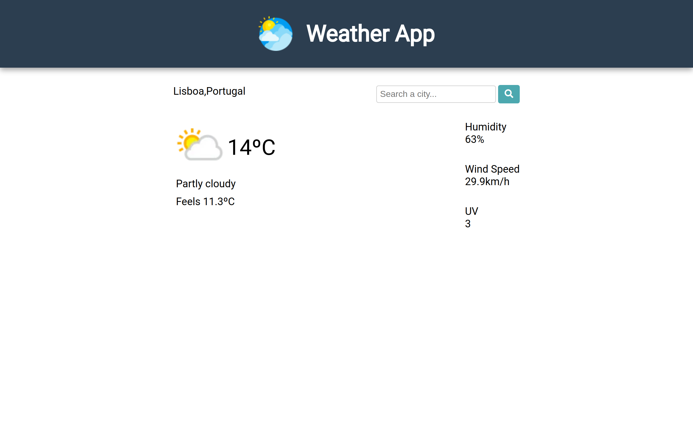

# Weather app

:point_right: [live demo](https://cmfernandes.github.io/weather-app/) 

---

## About

This project is a weather app that allows users to search for any city in the world and receive real-time weather forecasts.

The main purpose of this project was to practice:
- Asynchronous code
- Working with APIs

The API used was [Weather API](https://www.weatherapi.com/).

Assigment from [The Odin Project](https://www.theodinproject.com/lessons/node-path-javascript-weather-app) Javascript course. 
